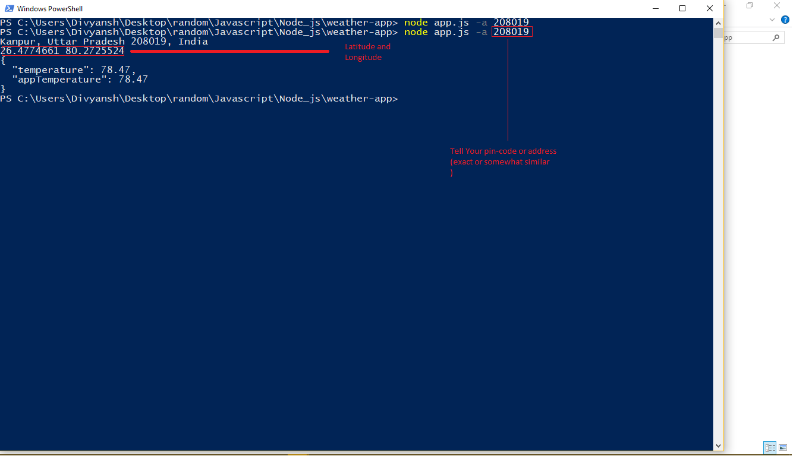

# Weather App

A command line weather app.

## Getting Started
```
* Get started with telling your address
```

### Prerequisites

What things you need to install the software and how to install them

```
*NODEJS
```

## Built With

* [NODEJS](https://www.nodejs.org) - The web framework used

## Contributing

Please read [CONTRIBUTING.md](https://gist.github.com/PurpleBooth/b24679402957c63ec426) for details on our code of conduct, and the process for submitting pull requests to us.


## Authors

* **Divyansh Dwivedi** - *Initial work*

See also the list of [contributors](https://github.com/your/project/contributors) who participated in this project.

## License

This project is currently unlicensed.

## Screenshot

